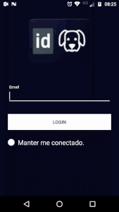

# IDDog Mobile

Are you sad? Do you need something to make you smile again? I have the solution for your problems. **IDDog is the most happy app ever made**, some important university of the world said this, believe me. You need just 2 minutes of cute dogs in your smartphone and that is it, **Happy**. Enjoy with IDDog!

## Getting Started

To perform login on IDDog you need just a valid e-mail and network connection.

## Installing

The installation is simple:

- Put the **IDDog.apk** file in some place of your smartphone that you have access;
- Go to **configuration -> security -> Unknown sources** and active this option;
- Go to place that you stored the application and double-click file;
- Follow the instructions of install;
- Have a happy life!

## Built With

* [Picasso](http://square.github.io/picasso/) - A powerful image downloading and caching library for Android
* [PhotoView](https://github.com/chrisbanes/PhotoView) - PhotoView aims to help produce an easily usable implementation of a zooming Android ImageView.

## Authors

* **Juliano Oliveira** - *Everything*

## License

This project is licensed under the MIT License - see the [LICENSE.md](LICENSE.md) file for details

## Improvements

* Click outside of image detail and back to grid view
* Timeout on login activity

